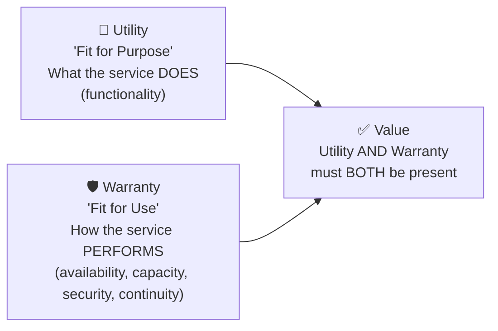
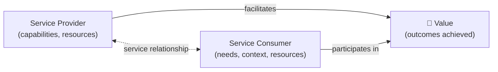
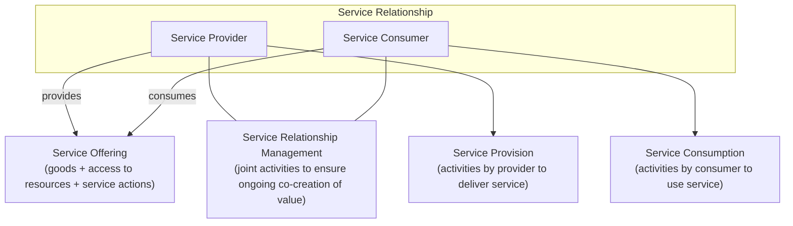
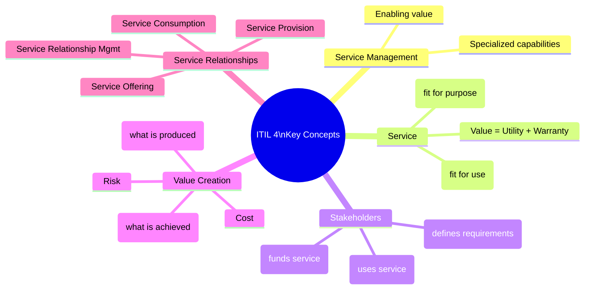

# 📖 Key Concepts of Service Management
{: .no_toc }

**The language of ITIL 4 — definitions that underpin every other concept**
{: .fs-5 .fw-300 }

---

## Table of Contents
{: .no_toc .text-delta }

1. TOC
{:toc}

---

## Why This Module Matters

This learning outcome carries **5 exam marks** and is the foundation of every other topic. Every definition here is directly testable — the exam will give you four options and ask you to identify the correct one.

---

## Core Definitions
{: #core-definitions }

### Service Management

> **Service management** is a set of specialized organizational capabilities for enabling value to customers in the form of services.

The key words: *specialized*, *organizational capabilities*, *value*, *customers*. It is not just about technology — it includes people, processes, and tools.

### Service

> A **service** is a means of enabling value co-creation by facilitating outcomes that customers want to achieve, without the customer having to manage specific costs and risks.

Three elements to remember:

| Element | Meaning |
|---------|---------|
| **Enabling value co-creation** | Value is created together — not just delivered |
| **Facilitating outcomes** | The service helps achieve results the customer cares about |
| **Without managing costs/risks** | The provider absorbs the complexity |

### Utility and Warranty

These two together define whether a service is fit for purpose and fit for use:

> **Utility** is the functionality offered by a product or service to meet a particular need — *fit for purpose*.

> **Warranty** is the assurance that a product or service will meet agreed requirements — *fit for use*.

> ⚠ **Exam Trap:** A service can have full utility (it does what was asked) but fail on warranty (it is unavailable or insecure). **Both are required for value.** A single-question classic: "Which of the following is an example of warranty?" — the answer will be something about availability, capacity, security, or continuity; NOT about what the service does.

### Stakeholders: Customer, User, and Sponsor

| Stakeholder | Role |
|-------------|------|
| **Customer** | Defines the requirements for services and takes responsibility for outcomes of service consumption |
| **User** | Uses the services directly day-to-day |
| **Sponsor** | Authorizes the budget for service consumption |

> ⚠ **Exam Trap:** These three roles can be the same person or different people. A typical exam question: "A manager approves the budget for a new IT tool but does not use it. What role are they playing?" — **Sponsor**.

---

## Value and Co-Creation

ITIL 4 shifts from "value delivery" (provider → customer) to **value co-creation** — both parties contribute.

### Key Value Concepts

| Concept | Definition |
|---------|------------|
| **Value** | The perceived benefits, usefulness, and importance of something |
| **Outcome** | A result for a stakeholder enabled by one or more outputs — *what is achieved* |
| **Output** | A tangible or intangible deliverable of an activity — *what is produced* |
| **Cost** | The amount of money spent on a specific activity or resource |
| **Risk** | A possible event that could cause harm or loss, or make it harder to achieve objectives |
| **Organization** | A person or group of people with functions, responsibilities, and authorities to achieve objectives |

> ⚠ **Exam Trap — Output vs Outcome:** An **output** is a deliverable (e.g. a report, a system, a document). An **outcome** is what that enables (e.g. "the business can now forecast revenue"). Confusing these is the most common error. Example: a new monitoring dashboard is an *output*; the reduced mean time to detect incidents is an *outcome*.

---

## Service Relationships

Service relationships exist between organisations in the roles of **service provider** and **service consumer**.

### The Four Service Relationship Concepts

| Concept | Definition |
|---------|------------|
| **Service offering** | A formal description of one or more services, designed to address the needs of a target consumer group. Includes goods, access to resources, and service actions |
| **Service relationship management** | Joint activities performed by a service provider and consumer to ensure continued value co-creation based on service offerings |
| **Service provision** | Activities performed by an organisation to provide services. Includes managing resources, ensuring access, fulfilling requests, and managing warranties |
| **Service consumption** | Activities performed by an organisation to consume services. Includes managing consumer resources, utilising the service, and requesting service actions |

### What a Service Offering Contains

| Component | Description | Example |
|-----------|-------------|---------|
| **Goods** | Transferred to consumer — ownership changes | Laptop hardware |
| **Access to resources** | Granted under agreed terms — provider retains ownership | Cloud storage subscription |
| **Service actions** | Performed by provider to address consumer needs | Helpdesk support |

> ⚠ **Exam Trap:** An organisation can simultaneously be a **service provider** and a **service consumer**. IT provides services to business units (provider), but IT also consumes services from cloud vendors (consumer). The same entity plays both roles depending on the relationship.

---

## Summary Diagram

---

[← Back to Home](/itil-4-foundation/) | [02 — Guiding Principles →](/itil-4-foundation/02-guiding-principles/)
