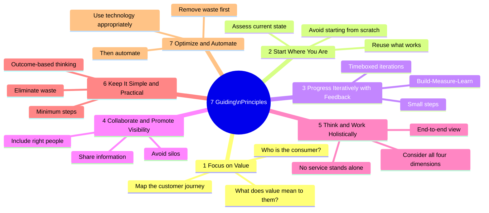
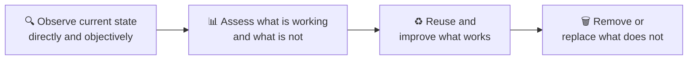
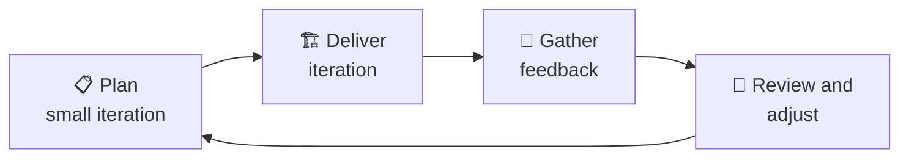
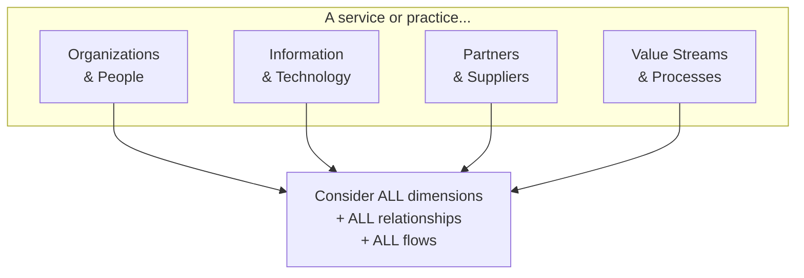
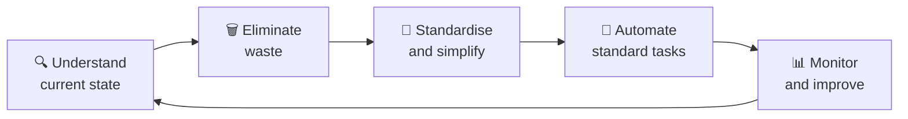
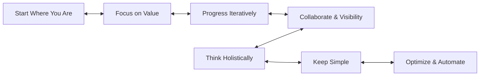

# 🧭 The 7 Guiding Principles
{: .no_toc }

**Recommendations that guide an organisation in all circumstances — regardless of changes in goals, strategies, type of work, or management structure**
{: .fs-5 .fw-300 }

---

## Table of Contents
{: .no_toc .text-delta }

1. TOC
{:toc}

---

## Why This Module Matters

The guiding principles carry **6 exam marks** — the second-highest single topic. You need to explain the *use* of each principle (Bloom's level 2), not just name them.

---

## Overview: The 7 Principles

---

## Principle 1: Focus on Value

**Everything the organisation does should link, directly or indirectly, to value for itself, its customers, and other stakeholders.**

| Question to ask | Why it matters |
|-----------------|----------------|
| Who is the service consumer? | Defines whose value matters |
| What is the consumer's perspective of value? | Value is subjective — defined by the consumer |
| What is the consumer's experience? | Customer experience (CX) and user experience (UX) |

> ⚠ **Exam Caveat:** "Focus on value" does not mean "only do things customers ask for." It means every activity should be traceable back to value for a stakeholder — including internal stakeholders, regulators, and society.

**How to apply it:**
- Know who the consumer of each service is before starting
- Map the customer journey to identify where value is created and where it is eroded
- Translate all technical objectives into outcomes that matter to the consumer

---

## Principle 2: Start Where You Are

**Do not start from scratch unless absolutely necessary. Assess what exists — services, processes, people, tools — and decide what can be reused or built upon.**

> ⚠ **Exam Caveat:** "Start where you are" does not mean "never change anything." It means: **measure and understand first** before deciding what to keep or discard. The principle guards against the common mistake of discarding existing value in pursuit of a "clean slate."

**How to apply it:**
- Observe services and practices directly — do not rely entirely on what you are told
- Use data and measurement to understand the current state
- Successful existing practices may be invisible — look for them before declaring them absent

---

## Principle 3: Progress Iteratively with Feedback

**Do not attempt to do everything at once. Organise work into smaller, manageable iterations. Seek and incorporate feedback at every step.**

| Concept | Meaning |
|---------|---------|
| **Iteration** | A timeboxed unit of work with a defined output |
| **Feedback loop** | Information gathered from the outcome of each iteration, used to improve the next |
| **Minimum Viable Product (MVP)** | Smallest version that delivers testable value |

> ⚠ **Exam Caveat:** "Iteratively" is closely associated with Agile and DevOps — ITIL 4 explicitly incorporates these ways of working. The principle does not prescribe a specific methodology (Scrum, Kanban, etc.) — it prescribes the mindset of **small steps + feedback**.

**How to apply it:**
- Understand what "enough" looks like before starting — avoid scope creep
- Each iteration should be complete and deliver testable value
- Fast feedback reduces the cost of correction

---

## Principle 4: Collaborate and Promote Visibility

**Work together across boundaries. Make work, progress, and results visible to those who need to see it.**

The principle has two distinct parts:

| Part | Description |
|------|-------------|
| **Collaborate** | Include the right people from the right places — break down silos |
| **Promote visibility** | Make information accessible; work done in isolation is rarely aligned |

> ⚠ **Exam Caveat:** The principle explicitly warns against "us vs them" thinking between IT and the business, or between teams. Decisions made without the right people lead to resistance and rework. Visibility applies to workflows, not just outcomes — stakeholders need to see *how* things are progressing, not just the end result.

**How to apply it:**
- Identify all stakeholders who will be affected by or contribute to a decision
- Use workflow tools (boards, dashboards) to make progress visible
- Understand that collaboration is not consensus — it means involving the right people, not requiring everyone to agree

---

## Principle 5: Think and Work Holistically

**No service or element works in isolation. All four dimensions of service management must be considered. All activities, practices, and services should be integrated and coordinated.**

> ⚠ **Exam Caveat:** "Holistic" does not mean "do everything." It means understanding how each part of the system relates to the whole — and not optimising one element at the expense of another. A change that improves the technology dimension but ignores people and processes is not holistic.

**How to apply it:**
- When designing or changing a service, review all four dimensions
- Understand how changes upstream affect downstream activities
- Recognise that value streams cut across organisational boundaries

---

## Principle 6: Keep It Simple and Practical

**Use the minimum number of steps needed to achieve an objective. Start with a simple, practical approach and only add complexity when evidence demands it.**

| Rule of thumb | Example |
|---------------|---------|
| If something adds no value — eliminate it | Approval steps with no decision-making power |
| Fewer steps = less risk of failure | Streamlined change process |
| Outcome-based design | Ask "what result does this step achieve?" |

> ⚠ **Exam Caveat:** "Keep it simple" does not mean "be careless." It means **avoid unnecessary complexity**. The principle also guards against exception-driven design — building an entire process around rare edge cases makes the normal path unnecessarily complex for everyone.

**How to apply it:**
- Design for the common case first; handle exceptions separately
- Challenge every step: "What happens if we remove this?"
- Acknowledge that simplicity requires effort — it is not the same as laziness

---

## Principle 7: Optimize and Automate

**Maximise the value of work carried out by human and technical resources. Automate what can be automated — but only after the process has been optimised.**

| Stage | What happens |
|-------|-------------|
| **Optimise first** | Remove waste, simplify steps, eliminate variation |
| **Then automate** | Apply technology to a stable, understood process |
| **Never automate chaos** | Automating a bad process produces bad results faster |

> ⚠ **Exam Trap — Order matters:** The principle explicitly states "optimise and **then** automate." If you automate before optimising, you embed inefficiency at scale. This is a classic exam question: "In which order should an organisation approach process improvement?" Answer: **optimise first, then automate**.

**How to apply it:**
- Identify and measure waste before purchasing automation tooling
- Use automation for repetitive, well-understood, low-risk tasks first
- Keep human judgment in the loop for complex decisions

---

## How the Principles Interact

The 7 principles are **not a sequential checklist** — they interact and reinforce each other at all times.

> ⚠ **Exam Trap:** No single principle takes priority over others. The exam may present a scenario and ask which principle is **most relevant** — choose based on the *specific challenge described* (e.g. silos → Collaborate; starting a new initiative → Start Where You Are; too many approval steps → Keep it Simple).

---

## Quick-Reference Summary

| # | Principle | Core Idea | Exam Trigger Word |
|---|-----------|-----------|-------------------|
| 1 | Focus on Value | Trace everything back to stakeholder value | "Customer experience", "business outcome" |
| 2 | Start Where You Are | Assess before discarding | "Existing processes", "current state" |
| 3 | Progress Iteratively | Small steps + feedback loops | "Agile", "iteration", "feedback" |
| 4 | Collaborate & Visibility | Break silos, share information | "Silo", "stakeholder buy-in", "transparency" |
| 5 | Think Holistically | End-to-end, all four dimensions | "Integration", "impact of change" |
| 6 | Keep Simple & Practical | Remove unnecessary steps | "Too many approvals", "bureaucracy" |
| 7 | Optimize & Automate | Improve first, then automate | "Automation", "waste", "efficiency" |

---

[← 01 — Key Concepts](/itil-4-foundation/01-key-concepts/) | [03 — Four Dimensions →](/itil-4-foundation/03-four-dimensions/)
