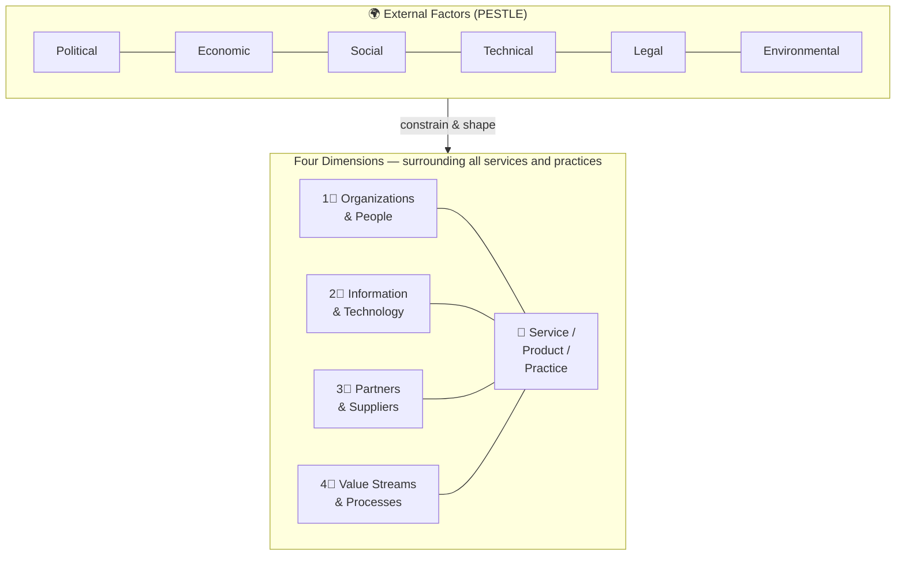
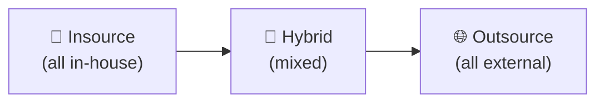
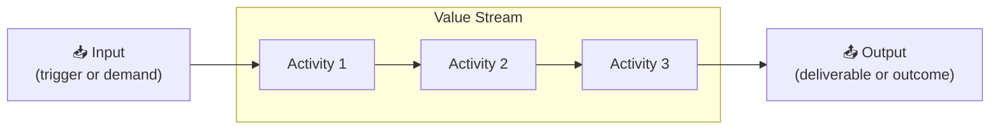

# 🔷 The Four Dimensions of Service Management
{: .no_toc }

**A holistic approach requires balancing four equally important dimensions — neglecting any one leads to incomplete or ineffective service management**
{: .fs-5 .fw-300 }

---

## Table of Contents
{: .no_toc .text-delta }

1. TOC
{:toc}

---

## Why This Module Matters

The four dimensions carry **2 exam marks**. Questions typically test whether you can identify which dimension is relevant to a given scenario, and understand what the **PESTLE external factors** are.

---

## Overview

Every product, service, and practice in ITIL 4 must be considered from **all four dimensions**. Think of them as four lenses applied to every decision.

---

## Dimension 1: Organizations and People

**Focuses on roles, responsibilities, formal organisational structures, cultures, and required staffing and competencies.**

| Element | Description |
|---------|-------------|
| **Organisational structure** | How teams, departments, and authority are arranged |
| **Culture** | Shared values and behaviours — often the hardest dimension to change |
| **Roles & responsibilities** | Who does what — including RACI-style clarity |
| **Competencies** | Skills and training required to deliver and support services |
| **Communication** | How information flows between people and teams |

**Key questions this dimension asks:**
- Does the organisation have the right people, skills, and culture?
- Are roles and responsibilities clearly defined?
- Does the leadership support the required ways of working?

> ⚠ **Exam Caveat:** Culture is explicitly part of this dimension. A service that has the right technology but the wrong culture or unclear responsibilities will fail. "People resist the new process" → this is a dimension 1 issue.

---

## Dimension 2: Information and Technology

**Covers the information and knowledge used in the delivery and management of services, as well as the technologies required.**

| Element | Description |
|---------|-------------|
| **Information** | Data, knowledge, and information assets used in service delivery |
| **Technology** | Applications, databases, infrastructure, AI/ML, cloud, automation tools |
| **Information management** | How information is created, stored, shared, and controlled |
| **Relationships between information assets** | Configuration items, dependencies |

**Questions this dimension asks:**
- What information is needed to deliver this service?
- What are the security and compliance requirements for information?
- What technologies best support the required activities?
- How does information flow between systems and teams?

> ⚠ **Exam Caveat:** This dimension includes **both** information (the data and knowledge) **and** the technology used to manage it. A question about data governance, CMDB management, or knowledge base tooling all point to dimension 2.

---

## Dimension 3: Partners and Suppliers

**Addresses an organisation's relationships with other organisations that are involved in the design, development, deployment, delivery, support, and/or continual improvement of services.**

| Element | Description |
|---------|-------------|
| **External service providers** | Cloud vendors, infrastructure providers, SaaS suppliers |
| **Supplier contracts** | Terms, SLAs, underpinning contracts |
| **Partnership arrangements** | Joint ventures, outsourcing, co-sourcing |
| **Service integration** | Managing multiple suppliers as part of a coherent service |

**The sourcing spectrum:**

**Questions this dimension asks:**
- Which activities should be done in-house vs outsourced?
- How do supplier relationships affect service quality?
- What contracts or agreements are needed?
- How are multiple suppliers integrated and managed?

> ⚠ **Exam Caveat:** Partners and suppliers is not just about cost — it is about **risk**, **capability**, and **strategic alignment**. A scenario about "the cloud provider's outage affected the service" is a dimension 3 scenario.

---

## Dimension 4: Value Streams and Processes

**Defines the activities, workflows, controls, and procedures needed to achieve the agreed objectives — and how they combine into value streams.**

| Concept | Definition |
|---------|------------|
| **Value stream** | A series of steps an organisation undertakes to create and deliver products and services to consumers |
| **Process** | A set of interrelated or interacting activities that transform inputs into outputs; processes define sequence and dependencies |
| **Activity** | A step or task within a process |
| **Workflow** | The specific sequence in which activities are performed |

**Questions this dimension asks:**
- What are the steps required to fulfil a request or resolve an issue?
- How do activities connect and hand off between teams?
- Where is there waste or delay in the flow?
- How are inputs transformed into outputs?

> ⚠ **Exam Caveat:** A value stream is end-to-end — it crosses organisational boundaries and dimensions. A process is a component of a value stream. "Mapping the steps from customer request to service delivery" describes a **value stream** question, not a process question.

---

## External Factors: PESTLE

The four dimensions are not independent — they are all shaped and constrained by **external factors** that the organisation cannot control.

| Factor | Meaning | Example impact on ITSM |
|--------|---------|------------------------|
| **P**olitical | Government policy, political stability | Regulatory changes affecting data hosting |
| **E**conomic | Economic climate, exchange rates | Budget cuts affecting staffing or tooling |
| **S**ocial | Demographics, cultural trends, remote working | Shift to hybrid working changes service desk demand |
| **T**echnical | Technology trends, innovation | Cloud adoption changes infrastructure sourcing |
| **L**egal | Legislation, regulations, compliance | GDPR requirements on data handling |
| **E**nvironmental | Climate, sustainability, carbon targets | Data centre energy requirements |

> ⚠ **Exam Caveat:** PESTLE factors are **external** — the organisation cannot control them, only respond to them. A question that mentions "new data protection legislation requires..." or "the economic downturn means..." is describing a PESTLE factor constraining the four dimensions.

---

## Dimension Quick-Reference

| Dimension | Key Words | "Which dimension?" trigger |
|-----------|-----------|---------------------------|
| **Organizations & People** | Culture, skills, roles, structure, leadership | "Staff don't understand", "responsibilities unclear" |
| **Information & Technology** | Data, CMDB, tools, applications, automation | "We need a tool for...", "data governance" |
| **Partners & Suppliers** | Vendors, contracts, outsourcing, SLAs | "Our supplier...", "third-party provider" |
| **Value Streams & Processes** | Workflow, steps, hand-offs, inputs/outputs | "The process is slow", "mapping the journey" |

---

[← 02 — Guiding Principles](/itil-4-foundation/02-guiding-principles/) | [04 — Service Value System →](/itil-4-foundation/04-service-value-system/)
