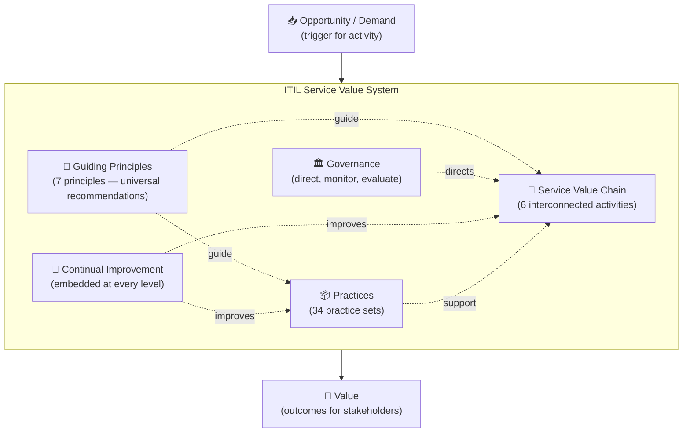
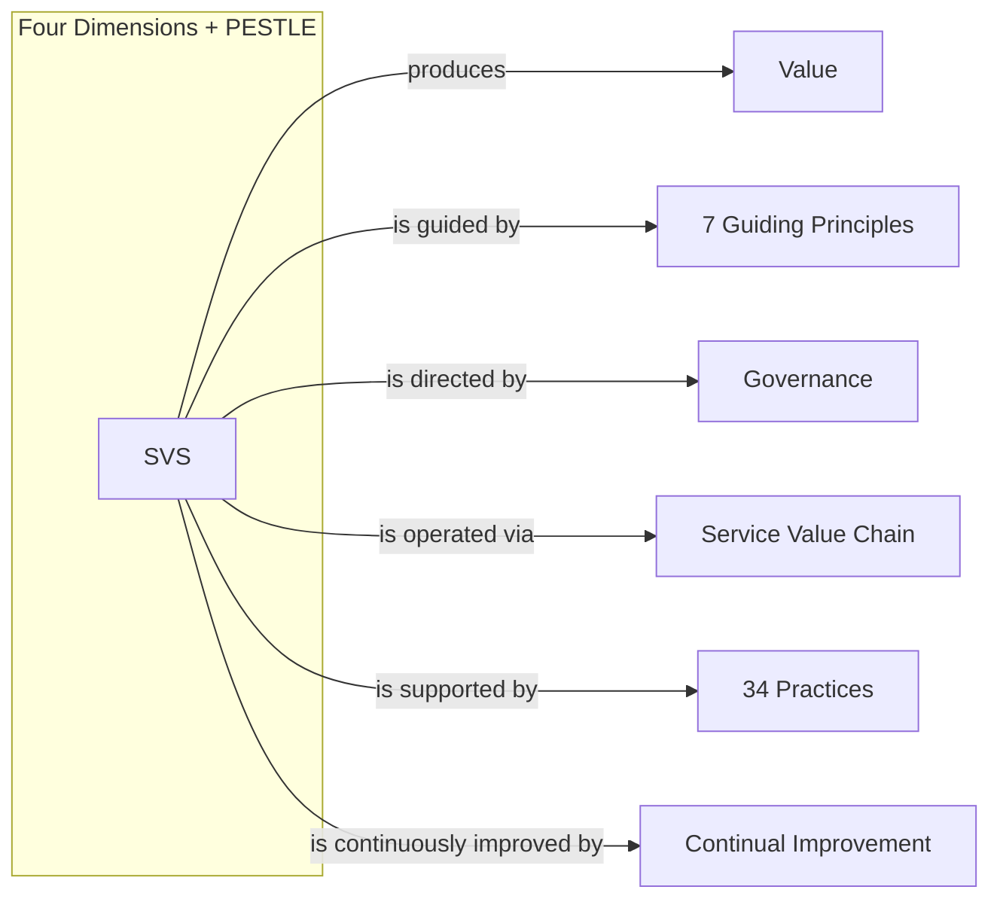

# ⚙ The Service Value System (SVS)
{: .no_toc }

**The model that shows how all components and activities of an organisation work together as a system to enable value creation**
{: .fs-5 .fw-300 }

---

## Table of Contents
{: .no_toc .text-delta }

1. TOC
{:toc}

---

## Why This Module Matters

The SVS carries **1 direct exam mark**, but it is the structural framework that holds everything else together. Understanding the SVS means understanding how guiding principles, governance, the service value chain, practices, and continual improvement all interrelate.

---

## SVS Overview

The **ITIL Service Value System** describes how an organisation's components and activities work together to enable value creation for all stakeholders.

---

## SVS Components in Detail

### Guiding Principles
The 7 guiding principles (covered in full in [Module 02](02-guiding-principles.md)) inform all decisions and actions within the SVS. They are universal — applicable in any circumstance and regardless of changes in strategy.

### Governance
Governance is the means by which an organisation is directed and controlled.

| Activity | Description |
|----------|-------------|
| **Evaluate** | Assess the organisation's portfolio of services, programmes, and projects |
| **Direct** | Assign responsibility and direction for strategy and policies |
| **Monitor** | Track performance of the organisation and its practices |

> ⚠ **Exam Caveat:** Governance in ITIL 4 is about **directing and monitoring** the SVS — it is not the same as "IT management." Governance sets the framework within which management operates.

### Service Value Chain
The central element of the SVS — an operating model outlining 6 key activities for creating value. Covered in full in [Module 05](05-service-value-chain.md).

### Practices
The 34 ITIL management practices that provide bodies of knowledge — with resources and capabilities — to accomplish work and achieve objectives. Covered in [Module 06](06-practices-overview.md) and [Module 07](07-seven-practices.md).

### Continual Improvement
An ongoing activity embedded throughout the SVS — not a one-time project. It applies to all services, products, practices, and the SVS itself. The Continual Improvement practice is also one of the 7 deep-dive practices (covered in [Module 07](07-seven-practices.md#continual-improvement)).

---

## Inputs and Outputs of the SVS

| Input | Description |
|-------|-------------|
| **Opportunity** | Options or possibilities to add value or improve the organisation |
| **Demand** | The need or desire for products and services from internal and external consumers |

| Output | Description |
|--------|-------------|
| **Value** | Perceived benefits, usefulness, and importance for stakeholders |

> ⚠ **Exam Caveat:** Both **opportunity** and **demand** are valid triggers for SVS activity. A new customer request is demand; a new technology that could improve services is an opportunity. The SVS converts both into value.

---

## Organisational Agility and the SVS

A key purpose of the SVS design is to enable **organisational agility** — the ability to respond quickly to changes in the environment. The SVS avoids rigid, siloed structures by:

- Allowing the service value chain activities to be combined in flexible ways (value streams)
- Embedding continual improvement at all levels
- Providing guiding principles rather than prescriptive rules

---

## How the SVS Relates to Other ITIL 4 Concepts

---

[← 03 — Four Dimensions](/itil-4-foundation/03-four-dimensions/) | [05 — Service Value Chain →](/itil-4-foundation/05-service-value-chain/)
