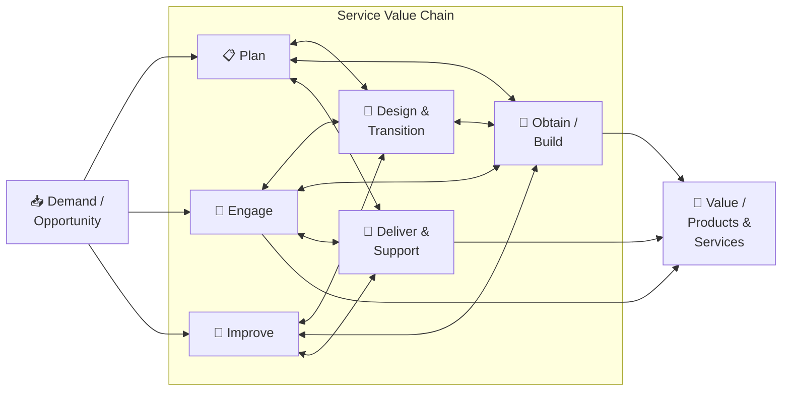

# 🔗 The Service Value Chain (SVC)
{: .no_toc }

**An operating model that outlines the key activities required to respond to demand and facilitate value realisation**
{: .fs-5 .fw-300 }

---

## Table of Contents
{: .no_toc .text-delta }

1. TOC
{:toc}

---

## Why This Module Matters

The SVC carries **2 exam marks**. You need to describe the purpose of each of the six activities and understand their interconnected nature.

---

## The Six Activities

> ⚠ **Exam Caveat:** The SVC activities are **not sequential** — they are interconnected and can be combined in many different ways to form **value streams** that match specific scenarios. There is no single fixed order.

---

## Activity 1: Plan

**Purpose:** To ensure a shared understanding of the vision, current status, and improvement direction for all four dimensions and all products and services across the organisation.

| Inputs | Outputs |
|--------|---------|
| Policies and requirements from governance | Strategic, tactical, and operational plans |
| Improvement initiatives | Portfolio decisions |
| Demand and opportunities | Architectures and policies |

**What it enables:**
- Alignment between strategy and delivery
- A shared understanding of direction across all teams
- Portfolio management decisions

---

## Activity 2: Improve

**Purpose:** To ensure continual improvement of products, services, and practices across all value chain activities and the four dimensions.

| Inputs | Outputs |
|--------|---------|
| Product and service performance information | Improvement initiatives |
| Stakeholder feedback | Improvement status reports |
| Performance against plans | Change requests to other activities |

**What it enables:**
- Continual improvement embedded at every level (not just a separate "CI project")
- Learning from incidents, feedback, and measurements
- Input into planning and all other SVC activities

> ⚠ **Exam Caveat:** Improve feeds into **every other activity**. It is the only activity that has direct links to all others. This makes it unique — it is not just one step in a sequence but an ongoing thread running through the entire SVC.

---

## Activity 3: Engage

**Purpose:** To provide a good understanding of stakeholder needs, transparency, and continual engagement and good relationships with all stakeholders.

| Inputs | Outputs |
|--------|---------|
| Consolidated demands and opportunities | Requirements and feedback for other activities |
| Feedback from users and customers | Service performance reports for customers |
| Product and service performance information | Contracts and agreements with suppliers |

**What it enables:**
- The single interface with customers, users, and external partners
- Capturing and prioritising demand
- Managing contracts and service level agreements

> ⚠ **Exam Caveat:** "Engage" is where the **service desk** and **relationship management** practice live in the context of the SVC. It is the organisation's front door — managing the ongoing relationship with all stakeholders.

---

## Activity 4: Design & Transition

**Purpose:** To ensure that products and services continually meet stakeholder expectations for quality, costs, and time to market.

| Inputs | Outputs |
|--------|---------|
| Portfolio decisions | Requirements and specifications |
| Architectures and policies | Solutions and components for Obtain/Build |
| Change requests | Test results and deployment packages |

**What it enables:**
- Designing new or changed services to meet requirements
- Managing the transition to production (ensuring changes do not disrupt existing services)
- Balancing speed of change with risk and quality

---

## Activity 5: Obtain / Build

**Purpose:** To ensure that service components are available when and where they are needed, and meet agreed specifications.

| Inputs | Outputs |
|--------|---------|
| Architectures and specifications | Service components for Deliver & Support |
| Contracts with suppliers | Knowledge and information |
| Change requests | Performance information and improvement opportunities |

**What it enables:**
- Acquiring, building, or configuring service components (whether bought or built internally)
- Managing the supply chain for components
- Ensuring readiness for deployment

---

## Activity 6: Deliver & Support

**Purpose:** To ensure that services are delivered and supported according to agreed specifications and stakeholders' expectations.

| Inputs | Outputs |
|--------|---------|
| New and changed services from D&T / O&B | Services delivered to customers/users |
| Contracts and agreements from Engage | Support information and improvement opportunities |
| Service components | Performance data |

**What it enables:**
- Day-to-day operation and support of live services
- Handling incidents, service requests, and operational events
- Feeding performance data back into Improve and Engage

---

## Value Streams: Combining SVC Activities

A **value stream** is a specific combination of SVC activities tailored to a particular scenario. Different scenarios produce different value streams.

```mermaid
%%{init: {'theme': 'base', 'themeVariables': { 'primaryTextColor': '#000', 'primaryBorderColor': '#000', 'gridLineStartPadding': '200', 'fontSize': '14px', 'fontFamily': 'Arial'}, 'gantt': {'numberSectionStyles': 4}}}%%
gantt
    title SVC Value Streams — Activity Combinations
    dateFormat X
    axisFormat %s

    section New Service
    Plan            :a1, 0, 1
    Engage          :a2, 1, 2
    Design & Trans  :a3, 2, 4
    Obtain/Build    :a4, 3, 5
    Deliver & Supp  :a5, 5, 6
    Improve         :a6, 0, 6

    section Incident
    Engage (Report) :b1, 0, 1
    Deliver & Supp  :b2, 1, 3
    Improve (Post)  :b3, 3, 4

    section Service Request
    Engage (Request) :c1, 0, 1
    Obtain/Build     :c2, 1, 2
    Deliver & Supp   :c3, 2, 3
```

> ⚠ **Exam Caveat:** The Gantt above shows how the same six activities combine differently for different scenarios. The exam may show a scenario (e.g. "a user reports a service outage") and ask which SVC activities are most involved. For an incident: primarily **Engage** and **Deliver & Support**; for a new service: primarily **Plan**, **Design & Transition**, **Obtain/Build**.

---

## SVC Activities Quick Reference

| Activity | One-line Purpose | Key Practices |
|----------|-----------------|---------------|
| **Plan** | Shared vision and direction | Strategy management, portfolio management |
| **Improve** | Ongoing improvement at all levels | Continual improvement |
| **Engage** | Stakeholder relationships and demand | Service desk, relationship management, SLM |
| **Design & Transition** | New and changed services meet requirements | Change enablement, release management |
| **Obtain / Build** | Components available when needed | Deployment management, IT asset management |
| **Deliver & Support** | Live services operating and supported | Incident management, service request management |

---

[← 04 — Service Value System](/itil-4-foundation/04-service-value-system/) | [06 — Practices Overview →](/itil-4-foundation/06-practices-overview/)
