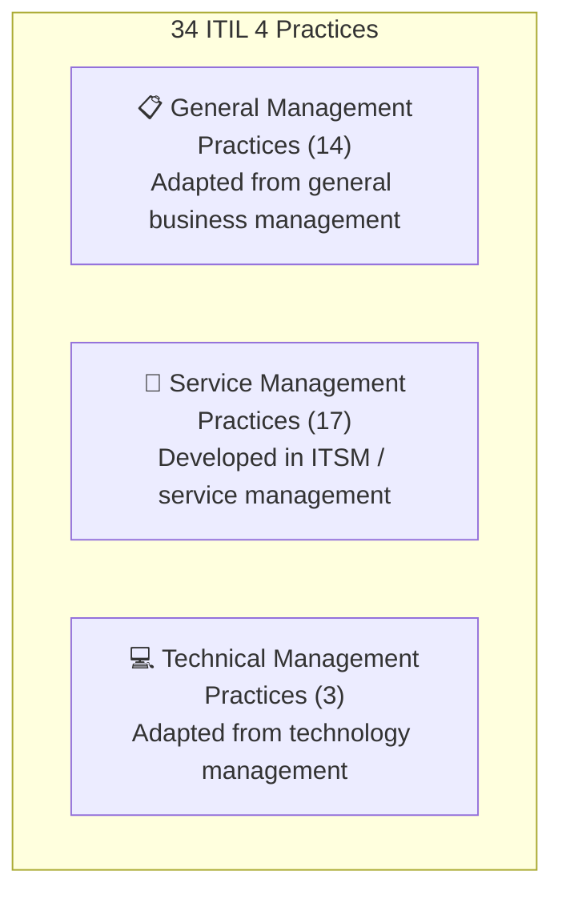

# 📦 Practices Overview
{: .no_toc }

**Purpose and key terms for the 15 exam-scoped practices — plus a full catalogue of all 34 ITIL 4 practices**
{: .fs-5 .fw-300 }

---

## Table of Contents
{: .no_toc .text-delta }

1. TOC
{:toc}

---

## Why This Module Matters

Learning Outcome 6 carries **7 exam marks**: 5 for recalling the purpose of 15 practices, and 2 for recalling 7 key definitions. These are **pure recall (Bloom's level 1)** questions — you must know these cold.

> ⚠ **Strategy:** These 15 purposes and 7 definitions are the highest-value rote-memorisation target in the entire exam. Flash-card them until instant recall.

---

## What Is a Practice?

> A **practice** is a set of organizational resources designed for performing work or accomplishing an objective.

ITIL 4 groups 34 practices into three categories:



---

## The 15 Exam-Scoped Practices (LO6) — Purpose

### General Management Practices

#### 1. Continual Improvement
**Purpose:** To align the organisation's practices and services with changing business needs through the ongoing identification and improvement of services, service components, practices, or any element involved in the efficient and effective management of products and services.

#### 2. Information Security Management
**Purpose:** To protect the information needed by the organisation to conduct its business. This includes understanding and managing risks to the confidentiality, integrity, and availability of information — and the authentication and non-repudiation aspects.

#### 3. Relationship Management
**Purpose:** To establish and nurture links between the organisation and its stakeholders at strategic and tactical levels. It includes identifying, analysing, monitoring, and continually improving relationships with and between stakeholders.

#### 4. Supplier Management
**Purpose:** To ensure that the organisation's suppliers and their performances are managed appropriately to support the provision of seamless, quality products and services.

### Service Management Practices

#### 5. Change Enablement
**Purpose:** To maximise the number of successful IT changes by ensuring that risks have been properly assessed, authorising changes to proceed, and managing the change schedule.

#### 6. Incident Management
**Purpose:** To minimise the negative impact of incidents by restoring normal service operation as quickly as possible.

#### 7. IT Asset Management
**Purpose:** To plan and manage the full lifecycle of all IT assets, to help the organisation maximise value, control costs, manage risks, support decision-making about purchase, re-use, retirement, and disposal, and meet regulatory and contractual requirements.

#### 8. Monitoring and Event Management
**Purpose:** To systematically observe services and service components, and record and report selected changes of state identified as events.

#### 9. Problem Management
**Purpose:** To reduce the likelihood and impact of incidents by identifying actual and potential causes of incidents, and managing workarounds and known errors.

#### 10. Release Management
**Purpose:** To make new and changed services and features available for use.

#### 11. Service Configuration Management
**Purpose:** To ensure that accurate and reliable information about the configuration of services, and the CIs that support them, is available when and where needed.

#### 12. Service Desk
**Purpose:** To capture demand for incident resolution and service requests. It should also be the entry point and single point of contact for the service provider with all of its users.

#### 13. Service Level Management
**Purpose:** To set clear business-based targets for service levels, and to ensure that delivery of services can be properly assessed, monitored, and managed against these targets.

#### 14. Service Request Management
**Purpose:** To support the agreed quality of a service by handling all pre-defined, user-initiated service requests in an effective and user-friendly manner.

### Technical Management Practices

#### 15. Deployment Management
**Purpose:** To move new or changed hardware, software, documentation, processes, or any other component to live environments. It may also be involved in deploying components to other environments for testing or staging.

---

## Key Term Definitions (LO6.2) — 7 Must-Know Terms

| Term | Definition |
|------|------------|
| **IT asset** | Any financially valuable component that can contribute to the delivery of an IT product or service |
| **Event** | Any change of state that has significance for the management of a service or other configuration item |
| **Configuration item (CI)** | Any component that needs to be managed in order to deliver an IT service |
| **Change** | The addition, modification, or removal of anything that could have a direct or indirect effect on services |
| **Incident** | An unplanned interruption to a service or reduction in the quality of a service |
| **Problem** | A cause, or potential cause, of one or more incidents |
| **Known error** | A problem that has been analysed but has not been resolved |

> ⚠ **Exam Trap — Incident vs Problem vs Known Error:**
> - **Incident** = the fire is burning right now — restore service immediately
> - **Problem** = the root cause investigation — what caused all these fires?
> - **Known error** = we know why it burns but haven't fixed it yet — document a workaround

> ⚠ **Exam Trap — Change vs Deployment:** A **change** is the decision and authorization (could affect anything). **Deployment** is the physical act of moving components to live environments. You can have a change without deployment (e.g. a process change), and deployment is always the result of an authorised change.

---

## All 34 Practices — Full Catalogue

### General Management Practices (14)

| Practice | Category | In LO6? | In LO7? |
|----------|----------|---------|----------|
| Architecture management | General | — | — |
| Continual improvement | General | ✅ | ✅ |
| Information security management | General | ✅ | — |
| Knowledge management | General | — | — |
| Measurement and reporting | General | — | — |
| Organizational change management | General | — | — |
| Portfolio management | General | — | — |
| Project management | General | — | — |
| Relationship management | General | ✅ | — |
| Risk management | General | — | — |
| Service financial management | General | — | — |
| Strategy management | General | — | — |
| Supplier management | General | ✅ | — |
| Workforce and talent management | General | — | — |

### Service Management Practices (17)

| Practice | Category | In LO6? | In LO7? |
|----------|----------|---------|----------|
| Availability management | Service | — | — |
| Business analysis | Service | — | — |
| Capacity and performance management | Service | — | — |
| Change enablement | Service | ✅ | ✅ |
| Incident management | Service | ✅ | ✅ |
| IT asset management | Service | ✅ | — |
| Monitoring and event management | Service | ✅ | — |
| Problem management | Service | ✅ | ✅ |
| Release management | Service | ✅ | — |
| Service catalogue management | Service | — | — |
| Service configuration management | Service | ✅ | — |
| Service continuity management | Service | — | — |
| Service design | Service | — | — |
| Service desk | Service | ✅ | ✅ |
| Service level management | Service | ✅ | ✅ |
| Service request management | Service | ✅ | ✅ |
| Service validation and testing | Service | — | — |

### Technical Management Practices (3)

| Practice | Category | In LO6? | In LO7? |
|----------|----------|---------|----------|
| Deployment management | Technical | ✅ | — |
| Infrastructure and platform management | Technical | — | — |
| Software development and management | Technical | — | — |

---

## LO6 Practice Memory Map

```mermaid
mindmap
classDef general fill:#5B9BD5,stroke:#2E5C8A,color:#fff
classDef service fill:#70AD47,stroke:#4A7030,color:#fff
classDef technical fill:#9E7BB5,stroke:#634969,color:#fff
  root[15 Exam Practices]
    General Management (4):::general
      Continual Improvement
      Information Security Mgmt
      Relationship Management
      Supplier Management
    Service Management (10):::service
      Change Enablement
      Incident Management
      IT Asset Management
      Monitoring & Event Mgmt
      Problem Management
      Release Management
      Service Config Mgmt
      Service Desk
      Service Level Mgmt
      Service Request Mgmt
    Technical Management (1):::technical
      Deployment Management
```

---

[← 05 — Service Value Chain](/itil-4-foundation/05-service-value-chain/) | [07 — Seven Practices In Depth →](/itil-4-foundation/07-seven-practices/)
