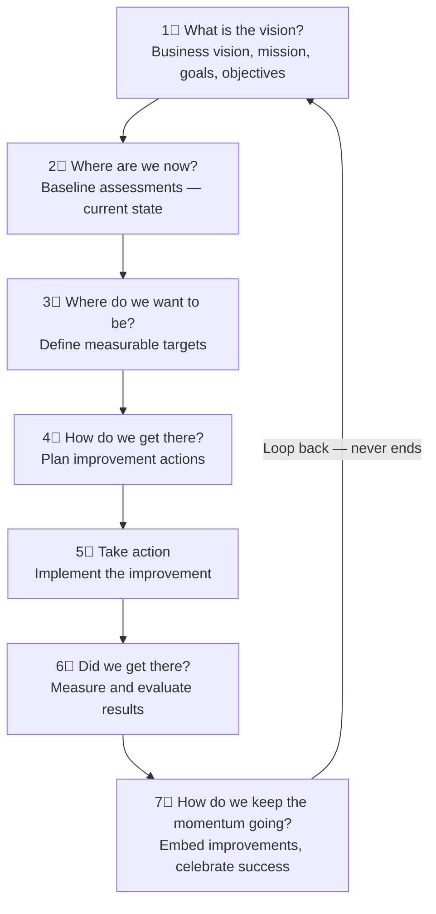
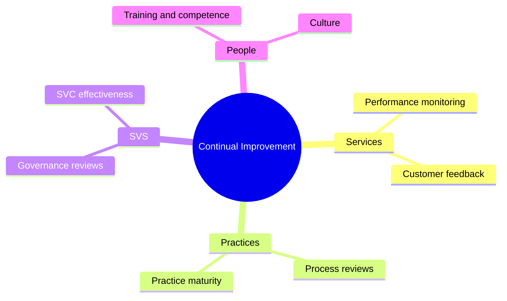
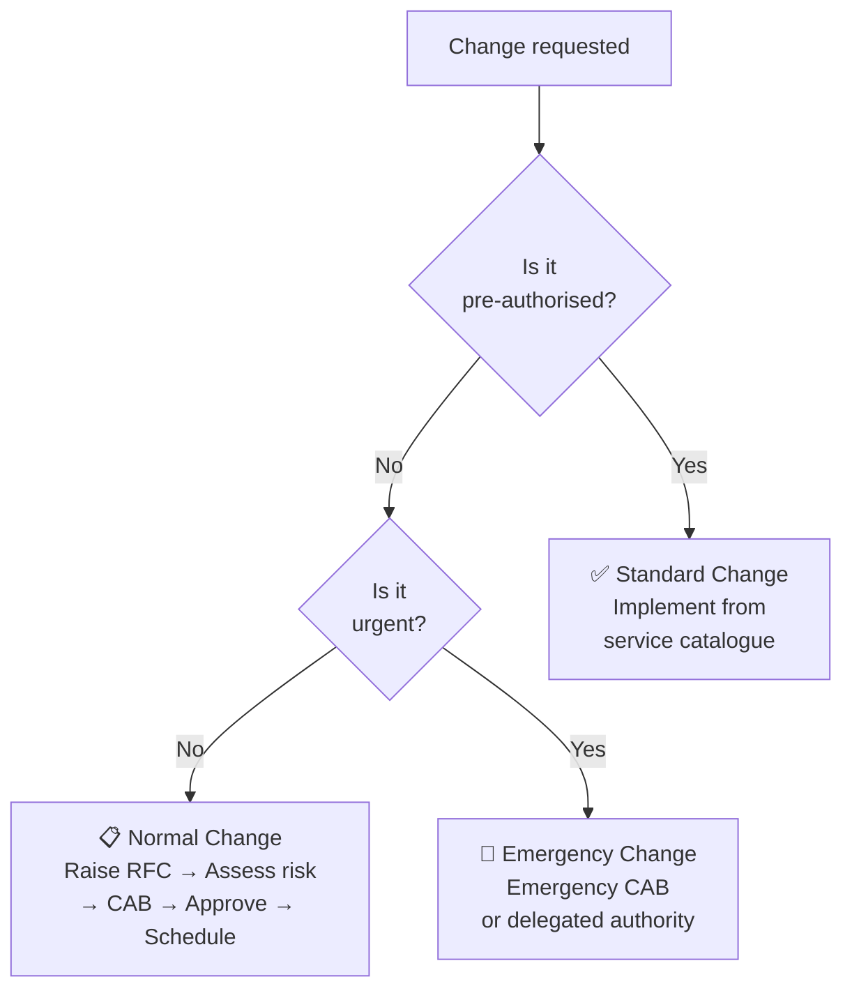
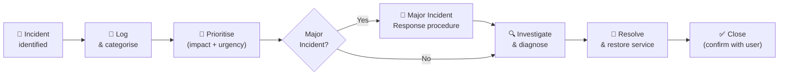
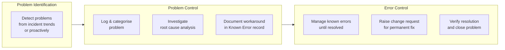
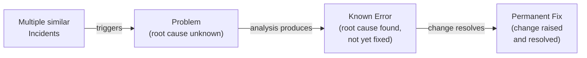
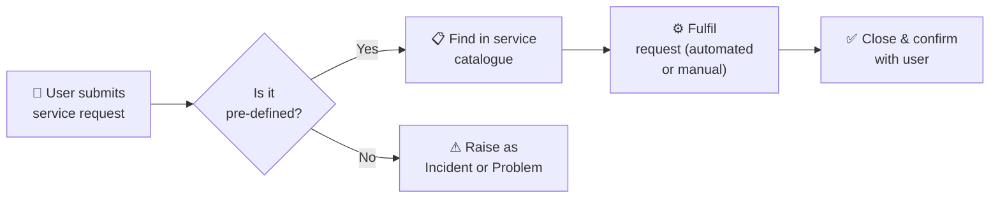
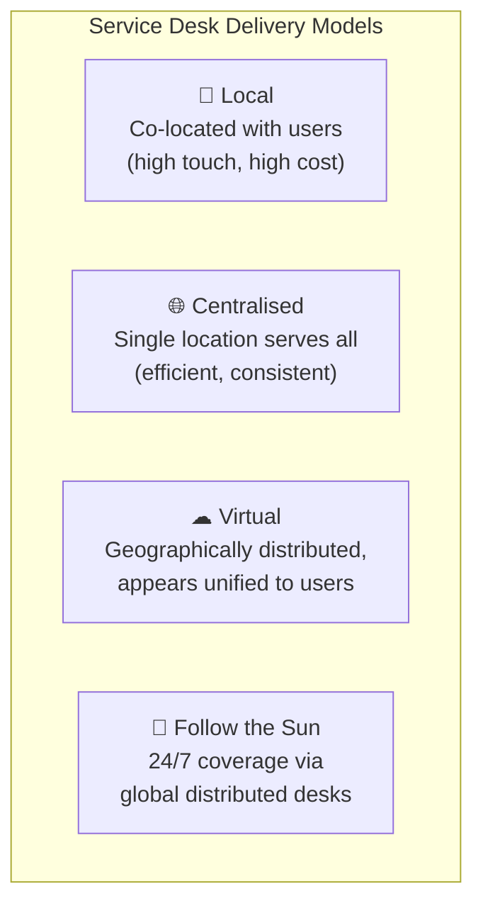
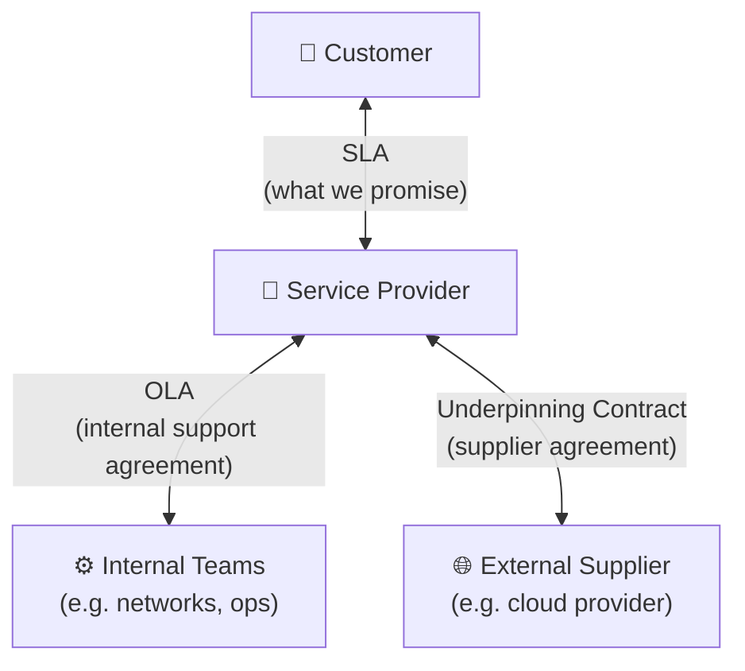
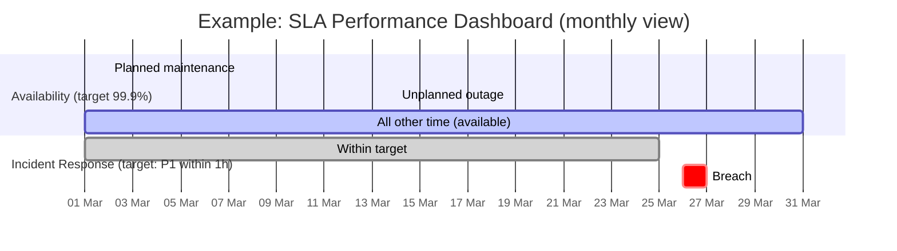

# 🔬 Seven Practices In Depth
{: .no_toc }

**The most heavily examined area of the ITIL 4 Foundation — 17 of 40 marks (42.5%)**
{: .fs-5 .fw-300 }

---

## Table of Contents
{: .no_toc .text-delta }

1. TOC
{:toc}

---

## Why This Module Matters

Learning Outcome 7 carries **17 exam marks** — more than any other single topic combined. Questions test understanding (Bloom's level 2), not just recall. You need to know *how* these practices work, not just what they are for.

---

## Continual Improvement (from the General Management Practices)
{: #continual-improvement }

**Purpose:** To align the organisation's practices and services with changing business needs through the ongoing identification and improvement of all services and practices.

### The Continual Improvement Model

The model provides a structured approach to implementing improvements of any size. It has **7 steps**:

| Step | Key Question | What happens |
|------|-------------|--------------|
| 1 | What is the vision? | Understand the high-level direction and strategic intent |
| 2 | Where are we now? | Assess current state — measure baselines objectively |
| 3 | Where do we want to be? | Define measurable targets aligned to the vision |
| 4 | How do we get there? | Design and plan the improvement initiative |
| 5 | Take action | Execute the plan — iteratively where possible |
| 6 | Did we get there? | Measure results against the targets defined in step 3 |
| 7 | How do we keep the momentum? | Embed changes, communicate success, start the next cycle |

> ⚠ **Exam Trap — Step Order:** Questions may describe a scenario and ask which step is next. The most common trap: **you cannot define "where we want to be" (Step 3) without first knowing "where we are now" (Step 2)**. Skipping the baseline leads to poorly defined targets.

> ⚠ **Exam Trap — It Never Ends:** Step 7 loops back to Step 1. Continual improvement is not a project with a finish line — the model reinforces that improvement is ongoing.

### Where CI Applies
CI is embedded throughout the SVS — not limited to a dedicated practice or team:

---

## Change Enablement (from the Service Management Practices)
{: #change-enablement }

**Purpose:** To maximise the number of successful IT changes by ensuring that risks have been properly assessed, authorising changes to proceed, and managing the change schedule.

### Types of Change

| Type | Description | Authorisation |
|------|-------------|---------------|
| **Standard** | Pre-authorised, low risk, well understood, documented procedure | Pre-approved (no CAB needed) |
| **Normal** | Must follow the full change process — risk assessment, approval, scheduling | Change authority (CAB or delegate) |
| **Emergency** | Must be implemented quickly to resolve a critical situation | Emergency CAB or delegated authority |

### Key Definitions

| Term | Definition |
|------|------------|
| **Change** | The addition, modification, or removal of anything that could have a direct or indirect effect on services |
| **RFC (Request for Change)** | A formal proposal for a change to be made |
| **Change authority** | A person or group responsible for authorising a change |
| **CAB (Change Advisory Board)** | A group that advises the change authority on assessment, prioritisation, and scheduling of changes |
| **Change schedule** | A document that includes all scheduled and planned changes |

> ⚠ **Exam Trap — "Change Management" is now "Change Enablement":** The name change is deliberate — ITIL 4 emphasises *enabling* and *facilitating* change, not just controlling it. The CAB is advisory, not always the authorising body.

> ⚠ **Exam Trap — Emergency vs Normal:** A change is Emergency not because it's important but because it needs to be implemented **faster than the normal change process allows**. Not all urgent changes are emergency changes — some urgent changes can still follow normal process if time permits.

---

## Incident Management (from the Service Management Practices)
{: #incident-management }

**Purpose:** To minimise the negative impact of incidents by restoring normal service operation as quickly as possible.

### Key Definitions

| Term | Definition |
|------|------------|
| **Incident** | An unplanned interruption to a service or reduction in the quality of a service |
| **Major incident** | An incident with significant business impact requiring a coordinated response |
| **Workaround** | A solution that reduces or eliminates the impact of an incident or problem for which a full resolution is not yet available |

### Incident Management Process

### Priority Matrix

Priority is determined by combining **Impact** (how much damage) and **Urgency** (how quickly it needs resolving):

| | High Urgency | Low Urgency |
|---|-------------|------------|
| **High Impact** | 🔴 Critical (P1) | 🟠 High (P2) |
| **Low Impact** | 🟡 Medium (P3) | 🟢 Low (P4) |

### Incident vs Problem

| | Incident | Problem |
|--|---------|---------|
| **Goal** | Restore service ASAP | Find and fix the root cause |
| **Focus** | Speed | Understanding |
| **Outcome** | Service restored (maybe via workaround) | Permanent fix or known error record |
| **Practice** | Incident management | Problem management |

> ⚠ **Exam Trap:** Incident management does **not** investigate root cause — that is problem management. An incident is closed when service is restored, even if only via a workaround. Root cause analysis happens separately and in parallel.

---

## Problem Management (from the Service Management Practices)
{: #problem-management }

**Purpose:** To reduce the likelihood and impact of incidents by identifying actual and potential causes of incidents, and managing workarounds and known errors.

### Three Phases of Problem Management

### Key Definitions

| Term | Definition |
|------|------------|
| **Problem** | A cause, or potential cause, of one or more incidents |
| **Known error** | A problem that has been analysed but has not been resolved |
| **Workaround** | A temporary measure to reduce impact — does not fix the root cause |
| **Problem record** | A record containing all details of a problem |
| **Known error record** | A record documenting a known error with its workaround |

### Problem Management Terminology Chain

> ⚠ **Exam Trap — Known Error ≠ Incident:** A known error is a *problem* that has been understood. It is **not** an incident record — it lives in the problem management space, not incident management. The known error record contains the workaround to help resolve future incidents faster.

> ⚠ **Exam Trap — Proactive vs Reactive Problem Management:**
> - **Reactive:** identifies problems after incidents have occurred (trend analysis of incident records)
> - **Proactive:** identifies problems before incidents occur (risk assessments, infrastructure analysis)
> Both are valid problem management activities.

---

## Service Request Management (from the Service Management Practices)
{: #service-request-management }

**Purpose:** To support the agreed quality of a service by handling all pre-defined, user-initiated service requests in an effective and user-friendly manner.

### What Is a Service Request?

> A **service request** is a request from a user or authorised user's representative that initiates a service action which has been agreed as a normal part of service delivery.

Service requests are **not incidents** — they are expected, planned, and pre-defined:

| Service Request Examples | Incident Examples |
|-------------------------|-------------------|
| Password reset | Email not accessible |
| New laptop provisioning | Laptop won't boot |
| Software installation | Application crashing |
| Access request | Access denied unexpectedly |
| Information request | Data missing from system |

> ⚠ **Exam Trap — Service Request vs Incident:** An incident is **unplanned**; a service request is **planned and expected**. If a user's email is broken, that is an incident. If a user wants a new email distribution list, that is a service request. The distinction drives which practice handles it.

> ⚠ **Exam Trap:** Service requests should be **standardised and automated** as much as possible. If they require individual assessment each time, that is a sign they are not properly defined in the service catalogue.

---

## Service Desk (from the Service Management Practices)
{: #service-desk }

**Purpose:** To capture demand for incident resolution and service requests. It is the **single point of contact** between the service provider and all users.

### Service Desk Characteristics

| Characteristic | Detail |
|---------------|--------|
| **Single point of contact** | All users contact the service desk — not individual teams |
| **Entry point** | First contact for all incident reports and service requests |
| **Human-centric** | Empathy and communication skills are as important as technical knowledge |
| **Multi-channel** | Phone, email, chat, self-service portal, walk-in |

### Service Desk Delivery Models

### Service Desk vs Other Practices

| Activity | Service Desk or Other Practice? |
|----------|---------------------------------|
| User reports email is down | **Service Desk** captures → **Incident Management** resolves |
| User requests new software | **Service Desk** captures → **Service Request Management** fulfils |
| Root cause analysis of repeated outages | **Problem Management** (not service desk) |
| Approving a firewall rule change | **Change Enablement** (not service desk) |

> ⚠ **Exam Trap — The service desk is not just a call centre.** It provides a human point of contact with real understanding and empathy. ITIL 4 explicitly states that service desk staff need "emotional intelligence" and good communication skills — the practice is not purely technical.

> ⚠ **Exam Trap — Service desk staff should NOT be specialists** in every technical domain. They should be skilled at capturing, categorising, prioritising, and escalating — and at communicating clearly with users. Deep technical resolution belongs to other teams.

---

## Service Level Management (SLM) (from the Service Management Practices)
{: #service-level-management }

**Purpose:** To set clear business-based targets for service levels, and to ensure that delivery of services can be properly assessed, monitored, and managed against these targets.

### Key Documents

| Document | Description |
|----------|-------------|
| **SLA (Service Level Agreement)** | Agreement between a service provider and a customer defining service level targets and provider's responsibilities |
| **OLA (Operational Level Agreement)** | Agreement between the service provider and an internal team supporting delivery of the SLA |
| **UC (Underpinning Contract)** | External contract between the service provider and a supplier — supports delivery of the SLA |

### What SLM Activities Include

| Activity | Description |
|----------|-------------|
| **Defining SLAs** | Agreeing measurable targets with customers |
| **Monitoring service performance** | Measuring against agreed targets |
| **Reviewing SLAs** | Regular service reviews with customers |
| **Reporting** | Providing performance data to stakeholders |
| **Service reviews** | Meetings to assess performance and agree improvements |

> ⚠ **Exam Trap — SLA is not just a document.** Service level management is about the ongoing **relationship and conversation** around service performance. An SLA that is written and then forgotten is a sign of poor SLM.

> ⚠ **Exam Trap — SLA scope:** A well-designed SLA covers:
> - Availability targets
> - Performance targets (response time, throughput)
> - Incident response and resolution targets
> - Service continuity provisions
> — but should **not** be so detailed that it becomes unmanageable. Keep it simple and practical (guiding principle 6).

### Metrics That Matter in SLM

> The Gantt above illustrates how SLM would visually track availability and response time targets against actuals across a reporting period. Breaches (red) are escalated and discussed in the service review.

---

## Seven Practices — Summary Comparison

| Practice | Purpose In One Line | Key Trap |
|----------|---------------------|----------|
| **Continual Improvement** | Ongoing improvement of everything, always | Step order: baseline before targets |
| **Change Enablement** | Maximise successful changes by managing risk and authorisation | Emergency ≠ always; Standard = pre-approved |
| **Incident Management** | Restore service ASAP — not find root cause | Incident management does NOT do RCA |
| **Problem Management** | Find root causes and manage known errors | Known error ≠ incident; proactive is also valid |
| **Service Request Management** | Fulfil pre-defined user requests efficiently | Request ≠ incident; must be pre-defined |
| **Service Desk** | Single point of contact — human, empathetic | Not a call centre; empathy matters |
| **Service Level Management** | Agree, monitor, report, and review service level targets | SLA is a relationship, not just a document |

---

[← 06 — Practices Overview](/itil-4-foundation/06-practices-overview/) | [08 — Exam Caveats & Cheatsheet →](/itil-4-foundation/08-exam-caveats-cheatsheet/)
