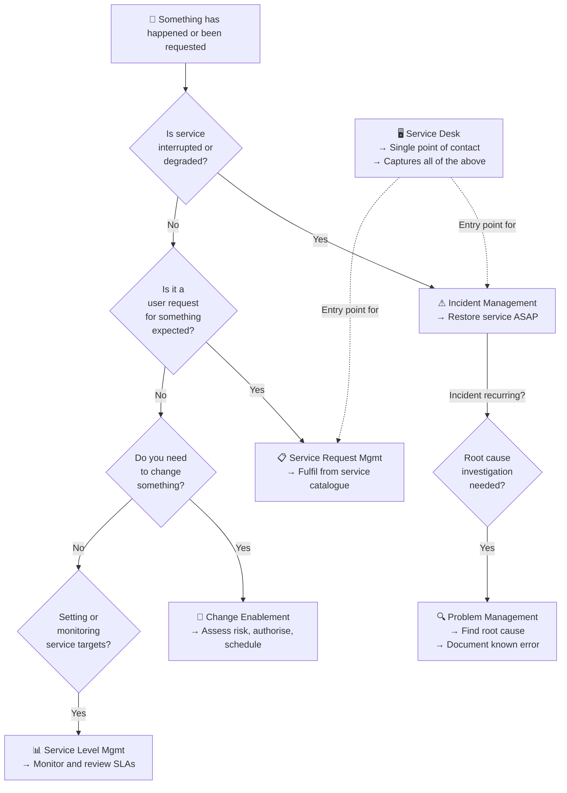
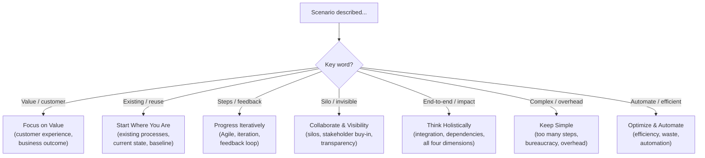

# 🎯 Exam Caveats & Cheatsheet
{: .no_toc }

**Everything you need to remember on exam day — traps, numbers, decision trees, and flash cards**
{: .fs-5 .fw-300 }

---

## Table of Contents
{: .no_toc .text-delta }

1. TOC
{:toc}

---

## Must-Memorise Numbers

| Fact | Value |
|------|-------|
| Total exam questions | **40** |
| Exam duration | **60 minutes** (75 min for non-native speakers) |
| Pass mark | **26 / 40 — 65%** |
| Bloom's levels | **1** (recall) and **2** (understand) |
| Guiding principles | **7** |
| Dimensions of service management | **4** |
| SVS components | **5** (guiding principles, governance, SVC, practices, CI) |
| SVC activities | **6** (Plan, Improve, Engage, Design & Transition, Obtain/Build, Deliver & Support) |
| LO6 practices (purpose only) | **15** |
| LO7 practices (in depth) | **7** |
| Total ITIL 4 practices | **34** |
| Marks for LO7 (7 practices in depth) | **17 / 40 = 42.5%** |
| PESTLE factors | **6** (Political, Economic, Social, Technical, Legal, Environmental) |
| Steps in the Continual Improvement Model | **7** |

---

## Named Exam Traps

### Trap 1 — Utility AND Warranty Are Both Required
Value requires **both** utility (fit for purpose) and warranty (fit for use). A service that does exactly what was asked but is constantly unavailable has utility but no warranty — and therefore provides **no value**.

### Trap 2 — Customer vs User vs Sponsor
- **Customer** = defines requirements and owns outcomes
- **User** = uses the service day-to-day
- **Sponsor** = signs the cheque (authorises the budget)
They can be the same person or three different people.

### Trap 3 — Output vs Outcome
- **Output** = what is produced (a dashboard, a report, a deployed application)
- **Outcome** = what is achieved because of that output (reduced MTTR, informed decisions, faster sales)
The exam will give you an output and call it an outcome, or vice versa.

### Trap 4 — Principles Are Universal, Not Sequential
All 7 guiding principles apply simultaneously. No single principle has priority over another. When a question asks "which principle is MOST relevant," look for the specific challenge described in the scenario.

### Trap 5 — Optimize THEN Automate (Not Simultaneously)
Automate only after optimising. Automating a broken process scales the problem. The principle is **Optimize and Automate** — in that order.

### Trap 6 — Incident Management Does NOT Investigate Root Cause
Incident management restores service. Root cause investigation is **problem management**. Closing an incident with a workaround is valid — the permanent fix is a separate problem management activity.

### Trap 7 — Known Error Is a Problem Record, Not an Incident
A known error lives in the problem management space. It means the root cause has been identified but not yet fixed. A workaround is documented against the known error record.

### Trap 8 — Service Request vs Incident
- **Service request** = planned, expected, pre-defined ("I'd like a new laptop")
- **Incident** = unplanned, unexpected, disruptive ("my laptop stopped working")
Service requests should be fulfilled from a service catalogue. If they require individual assessment each time, they are not properly defined as service requests.

### Trap 9 — Standard Change Is Pre-Approved
Standard changes do not need individual CAB approval every time. They have been **pre-approved** because they are low risk and follow a well-defined procedure. Emergency and Normal changes require individual authorisation.

### Trap 10 — Change Enablement, Not Change Management
The practice is called **Change Enablement** — not Change Management. The name signals the intention to *enable* change, not just control or block it.

### Trap 11 — SLA Is a Relationship, Not Just a Document
Service Level Management is ongoing — regular service reviews, performance monitoring, and conversations with customers. An SLA sitting in a drawer unreviewed is a failure of SLM.

### Trap 12 — The Service Desk Is Human-Centric
The service desk requires emotional intelligence and communication skills. It is not just a technical escalation point. ITIL 4 explicitly states empathy is a service desk skill.

### Trap 13 — PESTLE Factors Are External (Not Controllable)
PESTLE factors constrain the four dimensions from outside — the organisation responds to them, it does not control them.

### Trap 14 — Start Where You Are ≠ Never Change
"Start where you are" means **assess first before discarding**. It does not mean leaving everything unchanged. The principle guards against throwing away existing value unnecessarily.

### Trap 15 — Continual Improvement Step Order
You cannot define "where we want to be" (Step 3) without first establishing "where we are now" (Step 2). Always baseline first.

### Trap 16 — Value Is Co-Created, Not Delivered
ITIL 4 replaces "delivering value" with **co-creating value**. Both provider and consumer contribute. Value is not a thing the provider hands over — it emerges from the relationship and activities of both parties.

---

## Decision Tree: Which Practice?

---

## Decision Tree: Which Guiding Principle?

---

## Flash Cards — Core Definitions

| Term | Definition |
|------|------------|
| **Service** | A means of enabling value co-creation by facilitating outcomes customers want to achieve, without managing specific costs and risks |
| **Service management** | A set of specialized organizational capabilities for enabling value to customers in the form of services |
| **Utility** | Functionality offered by a product or service to meet a particular need — *fit for purpose* |
| **Warranty** | Assurance that a product or service will meet agreed requirements — *fit for use* |
| **Customer** | Defines requirements and takes responsibility for outcomes of service consumption |
| **User** | Uses services day-to-day |
| **Sponsor** | Authorises the budget for service consumption |
| **Outcome** | A result for a stakeholder enabled by outputs |
| **Output** | A tangible or intangible deliverable of an activity |
| **Risk** | A possible event that could cause harm, loss, or make objectives harder to achieve |
| **IT asset** | Any financially valuable component contributing to delivery of an IT product or service |
| **Event** | Any change of state that has significance for management of a service or CI |
| **Configuration item (CI)** | Any component that needs to be managed to deliver an IT service |
| **Change** | The addition, modification, or removal of anything that could affect services |
| **Incident** | An unplanned interruption or reduction in quality of a service |
| **Problem** | A cause, or potential cause, of one or more incidents |
| **Known error** | A problem that has been analysed but not yet resolved |
| **Service offering** | A formal description of services designed to address target consumer group needs |
| **Value stream** | A series of steps to create and deliver products and services to consumers |
| **Practice** | A set of organizational resources designed for performing work or accomplishing an objective |

---

## Flash Cards — 7 Guiding Principles

| # | Principle | Core Idea |
|---|-----------|-----------|
| 1 | **Focus on Value** | Everything traces back to stakeholder value |
| 2 | **Start Where You Are** | Assess before discarding; do not start from scratch |
| 3 | **Progress Iteratively with Feedback** | Small steps + feedback loops |
| 4 | **Collaborate and Promote Visibility** | Break silos; make work visible |
| 5 | **Think and Work Holistically** | End-to-end; consider all four dimensions |
| 6 | **Keep It Simple and Practical** | Minimum steps; outcome-based |
| 7 | **Optimize and Automate** | Optimise first, then automate |

---

## Flash Cards — 15 Practice Purposes (One Line Each)

| Practice | Purpose (one line) |
|----------|--------------------|
| **Continual Improvement** | Align practices and services with changing business needs through ongoing improvement |
| **Information Security Management** | Protect confidentiality, integrity, and availability of information |
| **Relationship Management** | Establish and nurture strategic and tactical stakeholder relationships |
| **Supplier Management** | Ensure suppliers are managed to support seamless service provision |
| **Change Enablement** | Maximise successful changes by assessing risk and managing authorisation |
| **Incident Management** | Restore normal service operation as quickly as possible |
| **IT Asset Management** | Manage IT asset lifecycle to maximise value and manage risk |
| **Monitoring and Event Management** | Observe services and record changes of state (events) |
| **Problem Management** | Reduce likelihood and impact of incidents by managing root causes |
| **Release Management** | Make new and changed services and features available for use |
| **Service Configuration Management** | Ensure accurate information about services and CIs is available when needed |
| **Service Desk** | Single point of contact to capture incidents and service requests |
| **Service Level Management** | Set and monitor business-based service level targets |
| **Service Request Management** | Handle pre-defined user-initiated requests effectively |
| **Deployment Management** | Move new or changed components to live (or test/staging) environments |

---

## Final Checklist Before the Exam

- [ ] Can you define service, utility, warranty, customer, user, sponsor without notes?
- [ ] Can you explain the difference between output and outcome with an example?
- [ ] Can you name all 7 guiding principles in order?
- [ ] Can you explain what each guiding principle guards against?
- [ ] Can you name the 4 dimensions and give one example of each?
- [ ] Can you name the 5 SVS components?
- [ ] Can you name all 6 SVC activities and state the purpose of each?
- [ ] Do you know the 7 steps of the Continual Improvement Model in order?
- [ ] Can you distinguish Standard / Normal / Emergency change?
- [ ] Can you explain why incident management does NOT do root cause analysis?
- [ ] Can you explain the difference between incident, problem, and known error?
- [ ] Can you distinguish a service request from an incident with examples?
- [ ] Can you explain what an SLA, OLA, and underpinning contract are?
- [ ] Do you know all 15 practice purposes (one line each)?
- [ ] Do you know all 7 key term definitions (IT asset, event, CI, change, incident, problem, known error)?
- [ ] Do you know: 40 questions / 60 min / 26 to pass?

---

[← 07 — Seven Practices](/itil-4-foundation/07-seven-practices/) | [Back to Home →](/itil-4-foundation/)
