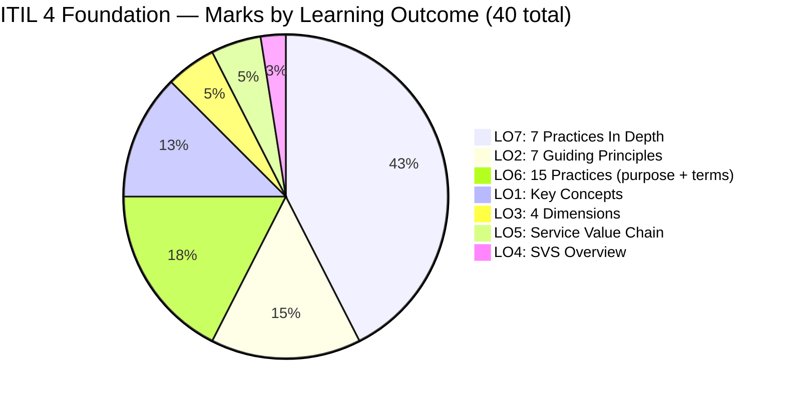
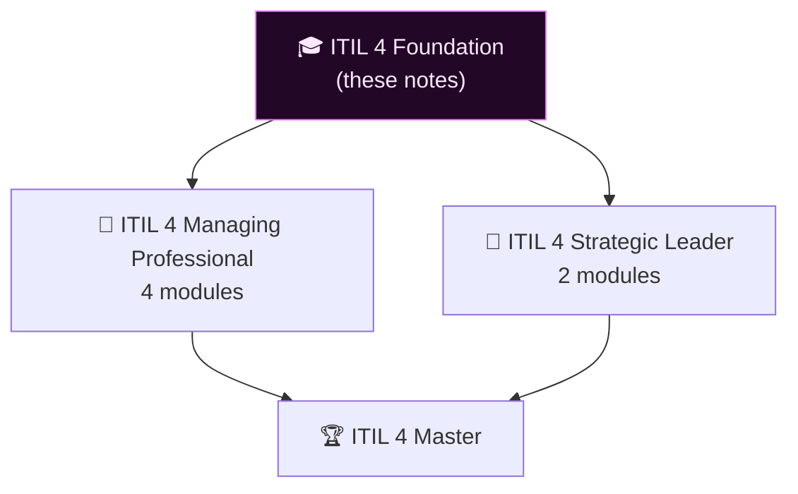

# 📋 ITIL 4 Foundation — Study Notes
{: .no_toc }

**Study Notes & Exam Prep — 2026 Edition**
{: .fs-5 .fw-300 }

[Start Studying →](/itil-4-foundation/01-key-concepts/){: .btn .btn-primary .fs-5 .mb-4 .mb-md-0 .mr-2 }
[View on GitHub](https://github.com/marcogrimaldi29/itil-4-foundation){: .btn .fs-5 .mb-4 .mb-md-0 }

> - 🎯 **Purpose:** Study notes covering the full ITIL 4 Foundation syllabus — aligned to the official PeopleCert/AXELOS candidate syllabus with exact question weights per topic.
> - 📅 **Version:** 2026
> - ✍ **Author:** [Marco Grimaldi](https://www.linkedin.com/in/marco-grimaldi29/)
> - 🌐 **Published:** [marcogrimaldi29.com](https://marcogrimaldi29.com)

---

## 🗺 What's in This Repository?

| File | Coverage | Exam Marks |
|------|----------|-----------|
| [📖 01 — Key Concepts of Service Management](01-key-concepts.md) | Service, value, utility, warranty, stakeholders, service relationships | **5** |
| [🧭 02 — The 7 Guiding Principles](02-guiding-principles.md) | All 7 principles — nature, use, and interaction | **6** |
| [🔷 03 — The 4 Dimensions of Service Management](03-four-dimensions.md) | Organizations & people, info & tech, partners & suppliers, value streams | **2** |
| [⚙ 04 — The Service Value System (SVS)](04-service-value-system.md) | SVS overview: governance, guiding principles, SVC, practices, CI | **1** |
| [🔗 05 — The Service Value Chain (SVC)](05-service-value-chain.md) | Plan, Improve, Engage, Design & Transition, Obtain/Build, Deliver & Support | **2** |
| [📦 06 — Practices Overview (15 Practices)](06-practices-overview.md) | Purpose & key terms for all 15 exam practices + full 34-practice catalogue | **7** |
| [🔬 07 — Seven Practices In Depth](07-seven-practices.md) | Deep dive: CI, Change Enablement, Incident, Problem, Service Request, Service Desk, SLM | **17** |
| [🎯 08 — Exam Caveats & Cheatsheet](08-exam-caveats-cheatsheet.md) | Exam traps, must-memorise definitions, decision trees, flash cards | — |

---

## 📊 Exam at a Glance

| Fact | Detail |
|------|--------|
| **Questions** | 40 multiple choice |
| **Duration** | 60 minutes (75 min for non-native speakers) |
| **Pass mark** | 26 / 40 — **65%** |
| **Book allowed?** | ❌ Closed book |
| **Negative marking?** | ❌ None |
| **Bloom's levels** | 1 (recall) and 2 (understand) |
| **Exam owner** | PeopleCert / AXELOS |

> ⚠ **Strategy:** LO7 (7 practices in depth) alone is worth **17/40 marks — 42.5% of the exam**. Prioritise these seven practices above everything else.

---

## ⚡ Quick Navigation

| I need to know… | Go to |
|-----------------|-------|
| Definition of service, utility, warranty | [01 — Key Concepts § Definitions](01-key-concepts.md#core-definitions) |
| The 7 guiding principles | [02 — Guiding Principles](02-guiding-principles.md) |
| The 4 dimensions and PESTLE | [03 — Four Dimensions](03-four-dimensions.md) |
| SVS components overview | [04 — SVS](04-service-value-system.md) |
| What each SVC activity does | [05 — Service Value Chain](05-service-value-chain.md) |
| Purpose of all 15 exam practices | [06 — Practices Overview](06-practices-overview.md) |
| Continual Improvement model steps | [07 — Seven Practices § Continual Improvement](07-seven-practices.md#continual-improvement) |
| Incident vs Problem vs Known Error | [07 — Seven Practices § Problem Management](07-seven-practices.md#problem-management) |
| Change types (Normal / Standard / Emergency) | [07 — Seven Practices § Change Enablement](07-seven-practices.md#change-enablement) |
| All exam traps in one place | [08 — Exam Caveats](08-exam-caveats-cheatsheet.md) |

---

## 🔑 Why ITIL 4 Foundation Matters

ITIL 4 Foundation is the **entry-level qualification** in the ITIL 4 certification scheme. It demonstrates understanding of the common language, key concepts, and how organisations can improve their work using the ITIL 4 guidance.

---

## ✍ About the Author

These notes are maintained by **[Marco Grimaldi](https://www.linkedin.com/in/marco-grimaldi29/)** — Cloud Consultant, Language Trainer & Lifelong Learner.

📍 **Find more content at [🌐 marcogrimaldi29.com](https://marcogrimaldi29.com)**

> ITIL® is a registered trade mark of AXELOS Limited, used under permission of AXELOS Limited. These are personal study notes and are not affiliated with or endorsed by AXELOS or PeopleCert.
